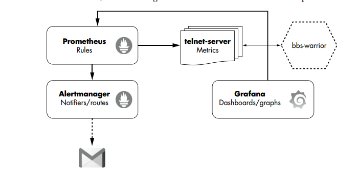
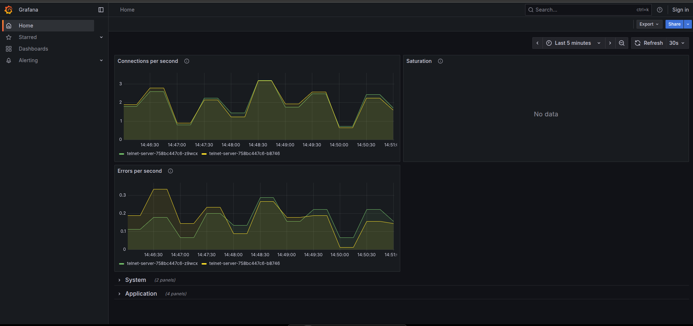
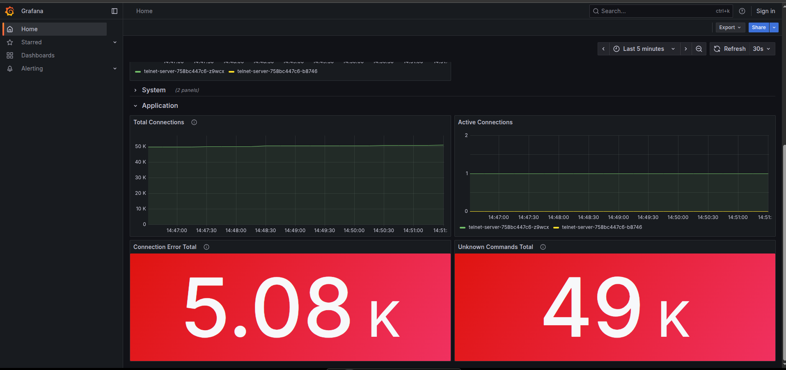
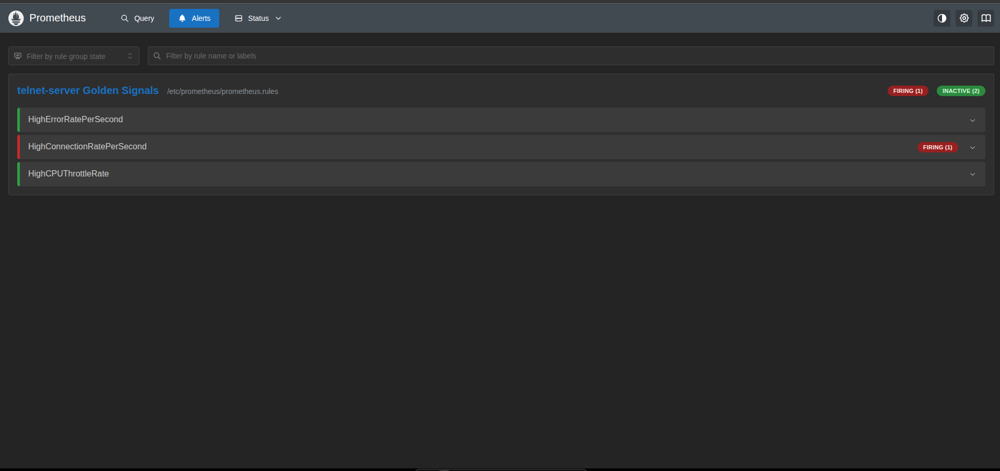
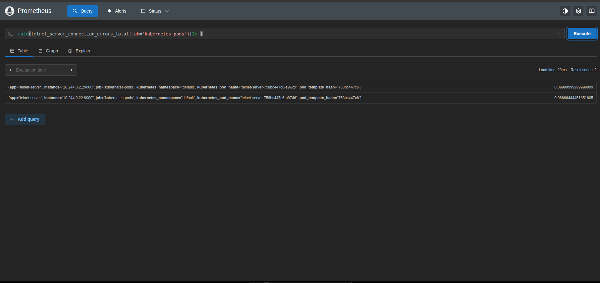

Observability is an attribute of a system, rather than something you do. It is a system’s ability to be monitored, tracked, and analyzed. 
The main goal in monitoring and observing a system is to discern what it is doing, internally. This is achieve by analyzing system outputs like metrics, traces, and logs. Any application worthy of production should be observable.
1. Metrics: are numerical measurements that quantify system performanceover a period of time.
2. Traces: are a way to record the actions a user performs while using your application or service, i.e. trace a request as it moves through many services.
3. Logs: are detailed records of events. They provide context and details about specific actions, errors, or state changes and are usually utilised for troubleshooting.

The degree of architectural complexity you are working with will ultimately determine what, how, and how much to observe.

Monitoring is any activity that involves keeping track of, evaluating, and sending out alerts based on predetermined criteria in order to determine the present status of a system. 
Applications must report metrics that can provide a narrative about the actions of the system at any given time in order to measure its condition.
PS: Always consider the “What?” and “Why?” when designing metrics and monitoring solutions for your applications. Avoid metrics or alerts
that do not provide value to stakeholders and engineers.

The monitoring applications used for this project are:
1. Prometheus: a metric collection application that queries metric data with its powerful built-in query language. It can set alerts for those metrics as well.
2. Alertmanager: receives alerts from Prometheus and determines their path depending on user-configurable parameters. Usually, the routes are notification.
3. Grafana: offers a user-friendly interface for creating and viewing graphs and dashboards using the data that Prometheus supplies.



#### Installing the Monitoring Stack

cd to the root directory of the project and run
```
kubectl apply -R -f monitoring/
```
chek that the deployment are up and running:
```
kubectl get all -n monitoring
```

Confirming the stacks are runnig as expected:
**minikube IP:Dynamic service port for Prometheus**
**minikube IP:Dynamic service port for Grafana**
**minikube IP:Dynamic service port for Alertmanager**
`OR`
```
minikube -n monitoring service grafana-service
minikube -n monitoring service prometheus-service
minikube -n monitoring service alertmanager-service
```
The bbs-warrior application is a Kubernetes CronJob that runs every minute and creates a random number of connections and errors to the telnetserver application.
To make sure bbs-warrior is active and installed correctly:
```
kubectl get cronjobs.batch -l app=bbs-warrior
kubectl get pods -l app=bbs-warrior
```

**Common metric patterns are:**
1. Golden Signals: (latency, traffic, errors, and saturation)--> help monitor microservices.
    * *Latency* is the time it takes for a service to process a request. 
    * *Traffic* is how many requests an application is receiving.
    * *Errors* refers to the number of errors an application is       reporting (such as a web server reporting 500s). 
    * *Saturation* is how full a service is. 
2. RED: (Rate, Error, Duration) --> help monitor microservices.
    * *Rate* is the number of requests per second a service is receiving 
    * *Error* is the number of failed requests per second (such as connection failures that a client experiences) that the service encounters 
    * *Duration* is the amount of time it takes to serve a request, or how long it takes to return data to client.
takes to return the data requested from your service to the client
3. USE: (Utilisation, Saturation, Errors) --> for quickly discovering performance issues based on underlying resources (infrastructure) rather than the microservices that run on them.
    * *Utilization* is the average time the resource is busy doing work
    * *Saturation* can be thought of as extra work the system could not get to, such as happens with a busy host that is queueing up connections to serve traffic. 
    * *Errors* are the number of errors (such as network collisions or disk IO errors) a system is having.

***The telnet-server Observability Dashboard***





