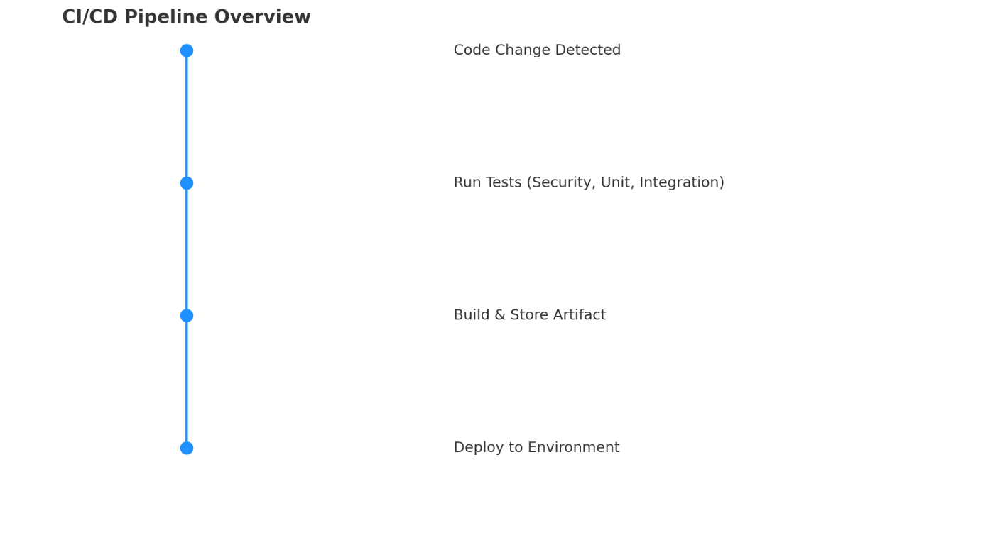

### CONTAINERIZING AN APPLICATION WITH DOCKER

A `container` is a lightweight, isolated, and portable runtime environment created from a `container image`. It packages an application with its dependencies, ensuring consistency across development, testing, and production environments.
When a container starts, a writable layer is added to manage file changes during runtime.
Containers use Linux `namespaces` and `cgroups` to provide isolation:
- **Namespaces** restrict what a container can see (e.g., filesystems, processes, networks).
- **Cgroups** restrict what a container can use (e.g., CPU, memory).

This combination makes `OS-level virtualization` efficient and secure.

#### Dockerfile
The Dockerfile contains the instructions that teach the Docker server how to turn an application into a container image.

The most popular instructions are shown below:
- **FROM:** It must be the first command in the file and specifies the parent or base image from which the new image is to be built.
- **COPY:** adds files to a location in the image filesystem from your current directory, which houses the Dockerfile.
- **RUN:** runs a command within the picture.
- **ADD:** copies new directories or files to a destination in the image filesystem from a source or a URL.
- **ENTRYPOINT:** The entry point enables your container to function as an executable, which is equivalent to any Linux.
- **CMD:** command-line program that accepts host arguments.
CMD gives the container a default command or set of parameters (it can be used with ENTRYPOINT).

To build and run the docker image created for this project, run the following:
To build from dockerfile
```
docker build -t dev-vm/telnet-server:v1 .
docker image ls dev-vm/telnet-server:v1
docker run -p 2323:2323 -d --name telnet-server dev-vm/telnet-server:v1
```
The -p (port) flag exposes port 2323 outside the container (The telnet-server application needs to have port 2323 open.), -d (detach)
flag launches the container in the background.
The left side of the colon (:) is the host port, and the right side is the container port. This is useful if you have another application listening on the same port and need to change it for the host while keeping the container port the same. 

To test the Container after running the docker command
```
telnet 127.0.0.2 2323
```
**q** to quit

To list existing image
==> docker image ls
To list running and non-running container
```
docker ps
docker ps -a
```
To stop a container
```
docker container stop <container-name>
```
To run a command inside a container or interact with a container, as if you were logged in to a terminal session.
```
docker exec <container-name> <command>
```
To remove a stopped container
```
docker rm <container-name>
```
To remove a docker image
```
docker rmi <container-name>
```
==> To get low-level information about docker object from a container in json format
```
docker inspect <container-name>
```
To get the history record of a docker image
```
docker history <image-name or repository-name>
```
To get a real-time update on the resources a container is using (like top in linux):
```
docker stats --no-stream <container-name>
```
To see all the logs in a container
```
docker logs <container-name>
```

### Orchestrating with K8s
K8s is the standard in container orchestration. One or more worker nodes and one or more control plane nodes make up a K8s cluster. 
A Raspberry Pi, bare-metal racked server, or cloud virtual machine can all be considered nodes. The cluster status, container scheduling, and K8s API requests are all managed by the control plane nodes. The control plane is where the main services (such the scheduler,etcd, and API) operate. The worker nodes execute the resources and containers that the control plane schedules.

Containers are able to communicate with one another both inside and outside the cluster . This occurs while operating a web server that is visible to the public or when microservices are used for internal communication.

A worker node can be configured for a particular use case, such as high connections, and rules can be made to guarantee that the apps that require that functionality are installed on that worker node. This is refer to nodeAffinity.

#### K8s Workload Resources
An object type that contains state and intent is called a resource. K8s resources are defined in a file called a manifest
**Pods:** They are smallest building elements of K8s. It can contain one or more containers, each container can connect to the other containers(networking), and can share a directory/storage between them by a mounted volume.

**ReplicaSet:** A ReplicaSet resource is used to maintain a fixed number of identical Pods. If a Pod is killed or deleted, the ReplicaSet will create another Pod to take its place.

**Deployments:** A Deployment is a resource that manages Pods and ReplicaSets. A Deployment’s main job is to maintain the state that is configured in its manifest. It controls a Pod’s lifecycle—from creation, to updates, to scaling, deletion. You can also roll back to earlier versions of a Deployment if needed.

**StatefulSets:** A StatefulSet is a resource for managing stateful applications. there are designed for stateful applications that require stable, unique identities and persistent storage. e.g PostgreSQL, ElasticSearch, and etcd. Similar to a Deployment, it can manage the state of Pods defined in a manifest. Each Pod in a StatefulSet has its own state and data bound to it. If you are adding a stateful application to your cluster, choose a StatefulSet over a Deployment.

**Services:** Services allow you to expose applications running in a Pod or group of Pods within the K8s cluster, as a sngle endpoint with a stable IP address and DNS name.
service types include:
1. `ClusterIP:`  This is the default type when you create a Service. It is assigned an internal routable IP address that proxies connections to one or more Pods. You can access a ClusterIP only from within the K8s cluster.
2. `Headless:` This service allows a client to connect to whichever Pod it prefers, directly. Unlike a standard K8s Service that provides a stable, single IP address and acts as a load balancer for a set of pods, a Headless Service exposes each pod through its own unique DNS record. 
3. `NodePort:` This exposes the Service on the node’s IP addresses and port.
4. `LoadBalancer:` This exposes the Service externally. It does this either by using a cloud provider’s component, like AWS’s Elastic Load Balancing (ELB), or a bare-metal solution, like MetalLB.
5. `ExternalName:` This type of service provides a way to map a Kubernetes Service to an external DNS name. Unlike other Service types (like ClusterIP, NodePort, or LoadBalancer) that expose a set of Pods within or outside the cluster, an ExternalName Service does not have a stable IP address and does not proxy traffic to Pods.

**Volumes:** A Volume is basically a directory, or a file, that all containers in a Pod can access, with some caveats. Volumes provide a way for containers to share and store data between them. If a container in a Pod is killed, the Pod-Volume and its data will survive; if the entire Pod is killed, the Pod-Volume and its contents will be removed. Thus, if you need storage that is not linked to a Pod’s lifecycle, use a `Persistent Volume (PV)` for your application. A ``PV`` is a resource in a cluster just like a node. Pods can use the PV resource, but the PV does not terminate when the Pod does. If your K8s cluster is running in AWS, you can use Amazon Elastic Block Storage (Amazon EBS) as your PV. This makes Pod catastrophes easier to survive.

**Secrets:** Secrets are object or placeholder for safely and reliably sharing sensitive information (such as passwords, tokens, SSH keys, and API keys, OAuth tokens) with Pods. You can access Secrets either via environment variables or as a Volume mount inside a Pod.

**ConfigMaps:** it is an API object designed to store non-confidential configuration data in key-value pairs. It allow decoupling of configuration data from image content to keep containerised applications portable and allow injecting of those configuration data into application pods. The ConfigMap can be accessed by a pod's containers as a file in a Volume mount, an environment variable, or command line arguments. 
There are two primary advantages to including any configuration files your application may have in a ConfigMap manifest. `First`, you don't need to relaunch your entire application in order to update or publish a new manifest file. `Second`, your application will be able to reload the configuration without requiring a restart if it is programmatically designed to monitor changes in a configuration file.

**Namespaces:** Namespaces provide a mechanism to separate/isolate a groups of resources within a single cluster into logical units. It helps granularly organize, allocate, manage, and secure cluster resources. A resource will inherit the witty default Namespace if you don't provide a Namespace when establishing it.

Use Minikube's Docker Daemon
To makes your local Docker CLI talk to Minikube’s internal Docker daemon instead of your machine’s default Docker, Run:
```
eval $(minikube docker-env)
```
Here’s what’s happening:

* Minikube runs its own lightweight VM (in my case, with kvm2).
* Inside that VM, it has its own Docker engine where Kubernetes pulls and stores container images.
* By running `eval $(minikube -p minikube docker-env)`
you’re telling your local docker CLI:
* “Hey, instead of building/running images on my local Docker Desktop, send them to the Docker daemon inside Minikube.”
* This is how you can build an image and have it instantly available to the Kubernetes cluster without pushing it to a registry.

```
docker build -t dev-vm/telnet-server:v1 .
```
```
kubectl apply -f kubernetes/
```
```
kubectl get all
```
To access the server, i used minikube tunnel command to expose the LoadBalancer service. The tunnel subcommand runs in the foreground, so it should be run in a terminal that won’t get closed.
```
minikube tunnel
```
with the tunnel up, I need to get the new external IP address
for the LoadBalancer Service
```
kubectl get svc telnet-server
```
In another terminal that is not running the tunnel, I use the telnet client command with the new IP address to access the telnet-server.
```
telnet <External-IP> <server-Port>
```
 Scaling a Pod (To scale the deployment to 3)
```
kubectl scale deployment telnet-server --replicas=3
```

#### Deploying Code with CI/CD Pipelines
`CI` (Continuous Integration) automates the building, testing, and validation of code changes.
`CD` (Continuous Delivery/Deployment) automates releasing these changes to environments like VMs or Kubernetes clusters.

Typical CI/CD pipeline flow:

1. Detect changes in source code from version control.
2. Test the changes (security scans, unit tests, integration tests).
3. Build & store artifacts (e.g., container images) in a shared repository.
4. Deploy artifacts to dev or prod environments using strategies such as:
    * Canary – release to a small subset of users first.
    * Rolling – gradually replace old versions with new ones.
    * Blue-Green – switch traffic from old (blue) to new (green) after testing. (a production service (blue) takes traffic while the new service (green) is tested. If the green code is operating as expected, the green service will replace the blue service, and all customer requests will funnel through it)



This process ensures changes are reliable, secure, and quickly delivered.

Following a successful deployment, the new code needs to be observed in a monitoring step to ensure that nothing has escaped the CI process.
#### Setting Up My Pipeline
For creating pipeline for this project, I will be using two tools:
1. Skaffold: For continuous development for K8s native applications. (https://skaffold.dev/docs/install/)
2. Container-structure-test: This command-line tool verifies the structure of the container image after it has been created. It can verify whether a particular file exists or run a command and check the results to see if the image was built correctly. It can also be used to confirm that the ports and environment variables that was provide in a Dockerfile were included in the container image. (https://github.com/GoogleContainerTools/container-structure-test/)

===========================================================
First I install the skaffold and Container-structure-test inside the directory where the yaml files live.
The skaffold.yaml file describes how to build, test, and deploy your application and it usually live in the root of the project directory where the dockerfile live under version control. 
To run start the pipeline
==> Ensure K8s cluster is running (minikube)
==> skaffold dev --cleanup=false
==> minikube tunnel => command to access the telnet-server application.
==> kubectl get svc telnet-server 
==> telnet <service-IP> <service-Port>

==> make code change by changing the ASCII text colour in the banner.go file to see how skaffold watch for change and initialise the CI/CD pipeline upon any change.

#### Testing a Rollback
Check the rollout history on K8s
==> kubectl rollout history deployment telnet-server
To make K8s to record the changes, add the <--record> flag when running <kubectl apply> to makes K8s record which command triggered
the deploy.

To roll to previous version (e.g version 5)
==> kubectl rollout undo deployment telnet-server --to-revision=5
